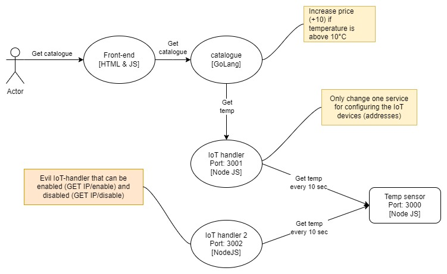
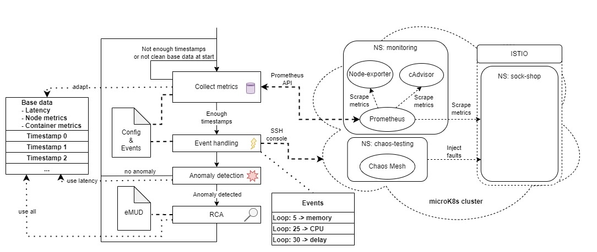

## IoMiRCA : IoT microservice root cause analysis
This project is the source code of the IoMiRCA paper, based on the MicroRCA code with some changes considering IoT devices.


### Testbed
The Testbed is an [adapted version](https://anonymous.4open.science/r/microservice-demo-EDFC/) of the [sock-shop](https://github.com/microservices-demo/microservices-demo) microservice testbed to include IoT devices. For that the catalogue service is changed to make a request to the IoT device for every catalogue list request. The whole communication to the IoT device is handled through the IoT-handler. Additionally there's another "evil" IoT-handler that is responsible for the MUD violations.
<center></center>

The load generation is done with a [locust script](https://anonymous.4open.science/r/Sock-shop_load-FAA0/)

### Algorithm
<center></center>
The algorithm first collects metrics for the base data. If we have our base data, we loop trough:

1. Get new metrics

2. (Automatically deploy an event based on the config file)

3. Anomaly detection

4. Root cause analysis if anomaly is detected

### Quick start

1. Clone the repository

2. Set up a microK8s cluster and deploy the testbed using the commands in the testbed [readme](https://anonymous.4open.science/r/microservice-demo-EDFC/)

3. Run the locust load generation [script](https://anonymous.4open.science/r/Sock-shop_load-FAA0/)

4. Run the IoMiRCA algorithm
```
python MicroRCA_online.py --folder 'data' --length 150 --url 'http://10.161.2.161:31090/api/v1/query'
```
